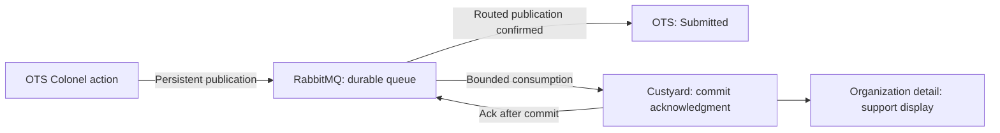

# Versioned Colonel Acknowledgment MVP

**Version:** 0.1
**Date:** 2026-09-30
**Status:** Custyard implementation available; OTS producer and production pilot pending

## Summary

An authenticated Onetime Secret (OTS) Colonel operator submits a versioned acknowledgment about an organization. OTS publishes the evidence to RabbitMQ, and Custyard subscribes, persists a dedicated acknowledgment record, and displays it to support. Confirmed publication is the initial durable capture for this standalone action; Custyard availability does not determine whether OTS can submit it.

## Goals

- A Colonel operator submits an acknowledgment with attributable identity and exact historical wording.
- Submitted acknowledgments survive Custyard downtime, consumer crashes, duplicate delivery, and broker restart.
- Support finds the acknowledgment in the organization's Custyard record.
- The flow provides a small production use case for Custyard.

## Non-Goals

- Customer-admin fair-use confirmation or customer acceptance of terms.
- Billing migration, provider selection, or changes to price, plan, and entitlements.
- A general consent platform or a general customer-event framework.

## Functional Requirements

### OTS submission

- Colonel Admin presents the exact statement and its version before the operator explicitly acknowledges it.
- OTS derives the operator's identity and role from the authenticated session.
- Every submission has a stable ID created before its first publication attempt. Retries retain that ID and the same evidence.
- OTS reports **Submitted** only after RabbitMQ confirms a successfully routed, persistent message.
- A returned, rejected, or unconfirmed publication does not produce a Submitted result. An unconfirmed attempt remains eligible for retry with the original submission ID.
- Submitted means the broker has accepted responsibility for the work. It does not assert that Custyard has stored the record.
- Confirmed RabbitMQ publication is sufficient initial capture for this standalone action; an OTS acknowledgment table or outbox is not a prerequisite.

### Evidence

Each submission contains the following evidence. Concrete field names and serialization belong to the message contract.

| Evidence | Meaning |
|----------|---------|
| Schema version | Version of the event's structure |
| Source | Stable OTS instance identity, qualified by environment |
| Submission ID | Identifier preserved across publication retries and redelivery |
| Organization ID | Stable organization identifier in the source instance |
| Actor ID and role | Authenticated Colonel operator and role at submission |
| Actor type | `internal_operator` |
| Statement key and version | Identity of the statement and its immutable revision |
| Statement text and hash | Exact wording presented and its content hash |
| Acknowledgment time | Time of the operator's action, preserved during retries |

The record attributes an internal operator's attestation to the organization. A customer representative's acknowledgment is a distinct action with a distinct actor category.

### Custyard consumption and persistence

- Custyard subscribes to the acknowledgment queue and controls processing volume through bounded prefetch and consumer concurrency.
- Custyard validates the evidence and resolves the source-qualified organization ID through an explicit mapping to a Custyard organization.
- An unresolved organization, unsupported schema, or invalid statement is a recoverable processing failure; it does not create evidence under a guessed organization.
- Custyard commits the dedicated acknowledgment record before acknowledging the RabbitMQ delivery.
- A database uniqueness constraint enforces source + submission ID.
- A repeated message with identical evidence resolves to the existing record and is acknowledged without another insert.
- Reuse of source + submission ID with different evidence enters the recoverable failure path and does not overwrite the original record.
- Custyard preserves the original evidence and records its receipt time separately. The application exposes no edit path for acknowledgment evidence.
- Transport deduplication does not collapse distinct submissions merely because they share an organization or statement version.

### Failures and recovery

- Unacknowledged deliveries become available again after consumer failure or connection loss.
- Transient processing failures follow a defined retry/backoff policy rather than an immediate, unbounded redelivery loop.
- Messages that cannot be processed remain in a retained failure queue with their original evidence, submission ID, and failure context.
- Moving a message to a retry or failure queue preserves recoverability before the original delivery is removed.
- Failed messages can be inspected and replayed after the underlying problem is corrected.

### Support display

- Authorized Custyard operators can find acknowledgments on the organization detail page.
- Each record displays the source, submission ID, Colonel actor, acknowledgment time, statement version, and exact historical wording.
- Acknowledgments are dedicated organization records; their existence does not require a conversation or a support email.

## Non-Functional Requirements

- **Durability:** Submitted evidence survives Custyard downtime and broker restart with persistent broker storage. Committed Custyard evidence survives application restart with persistent database storage.
- **Security:** Broker access identifies authorized publishers and consumers. Source identity and organization mapping prevent cross-instance or cross-environment attribution; operator display follows organization access permissions.
- **Observability:** Publication and processing outcomes are traceable by source + submission ID. Pending work and retained failures are visible to operators.
- **Availability:** Custyard downtime leaves submitted work in RabbitMQ. OTS submission depends on confirmed broker publication.

## In Scope

- One versioned Colonel acknowledgment action in OTS.
- Confirmed publication to a durable RabbitMQ queue.
- A bounded Custyard consumer with manual delivery acknowledgments.
- A dedicated, idempotently persisted Custyard acknowledgment record.
- Retry/backoff, retained failures, and replay.
- Organization-scoped support display.
- Production persistence and operator access sufficient to run and verify this flow.

## Out of Scope

- A required local OTS evidence table, outbox, or delivery-status table.
- A synchronous OTS-to-Custyard submission API or a Custyard-to-OTS receipt stream.
- Customer portal authentication and customer-admin acknowledgment UI.
- Automatic billing, access, or membership changes caused by an acknowledgment.
- Stripe or Airwallex integration and existing-customer migration.
- Support email ingestion or delivery as part of this acknowledgment flow.
- General document authoring, bulk customer synchronization, and acknowledgment correction workflows.
- High availability and protection against permanent loss of broker storage.

## Dependencies

- OTS Colonel authentication and organization identity.
- RabbitMQ with persistent storage and a durable acknowledgment queue and binding provisioned independently of the Custyard consumer.
- Persistent Custyard database storage and explicit OTS-to-Custyard organization mappings.
- Custyard operator authentication and organization detail view. Production operator login requires working magic-link email delivery.

## Constraints

- **OTS publishes; Custyard subscribes.** Routine communication between the applications is asynchronous. Explicit Colonel API lookups and idempotent synchronization are permitted operator exceptions outside this submission flow.
- RabbitMQ publication uses publisher confirms, persistent messages, durable routing topology, and mandatory publication with returned-message handling. A publisher confirm alone does not establish successful routing.
- Consumer delivery acknowledgment follows the database commit. The best-effort email-webhook audit path is not the acknowledgment persistence contract.
- Work and failure queues retain recoverable messages without silent expiry or overflow discard.
- RabbitMQ supplies redelivery; application and broker configuration define retry/backoff and failure retention.

## Acceptance Criteria

- A Colonel operator sees the exact versioned wording and submits attributable evidence.
- With Custyard stopped, a successfully routed and confirmed publication produces Submitted in OTS and remains queued.
- After Custyard resumes, the queued submission appears as exactly one organization acknowledgment.
- A queued, confirmed submission survives broker restart and is subsequently stored by Custyard.
- A consumer crash before database commit leaves the submission available for processing.
- A consumer crash after commit but before delivery acknowledgment results in redelivery and exactly one stored record.
- Repeated publication with the same source, submission ID, and evidence produces exactly one stored record.
- An unroutable publication does not produce Submitted, including when the broker also sends a publisher confirm.
- Conflicting evidence, invalid messages, and exhausted retries remain recoverable without modifying existing evidence.
- After an underlying processing problem is corrected, replay preserves the original evidence and submission identity and produces one valid record.
- The stored record and exact wording remain findable after a Custyard application restart.

## Diagram

## Open Questions

- **Statement:** The exact wording, statement key, and initial version require agreement before the OTS producer is enabled. Custyard preserves and displays the submitted wording.
- **OTS rollout:** Implement the Colonel action and confirmed publication in OTS using the [message contract](colonel-acknowledgment-contract.md). Agree the production source identity and provision pilot mappings before enabling publication.

## Implemented Custyard decisions

- The [v1 message contract](colonel-acknowledgment-contract.md) defines exact fields, limits, source attribution, hashing, and routing.
- Dedicated evidence records and explicit source/organization mappings enforce database idempotency and preserve historical wording.
- The bounded consumer defaults to prefetch 1 and manual acknowledgment after commit.
- Retry delays are 10 seconds, 60 seconds, and 300 seconds, followed by a retained failure queue. Confirmed transfers and quorum at-least-once retry routing preserve recoverability.
- The organization detail page exposes a paginated acknowledgment tab to authorized operators.
- Provisioning, idempotent mapping, status, inspection, and replay are available via Mix and production release operations; see the [operations guide](../ops/acknowledgments.md).

## References

- [RabbitMQ consumer acknowledgments and publisher confirms](https://www.rabbitmq.com/docs/confirms)
- [RabbitMQ reliability guide](https://www.rabbitmq.com/docs/reliability)
- [Quorum queues](https://www.rabbitmq.com/docs/quorum-queues) — reference for later availability requirements.
- [Custyard deployment](../flyio-deployment.md)
- [Message contract](colonel-acknowledgment-contract.md)
- [Acknowledgment operations](../ops/acknowledgments.md)
